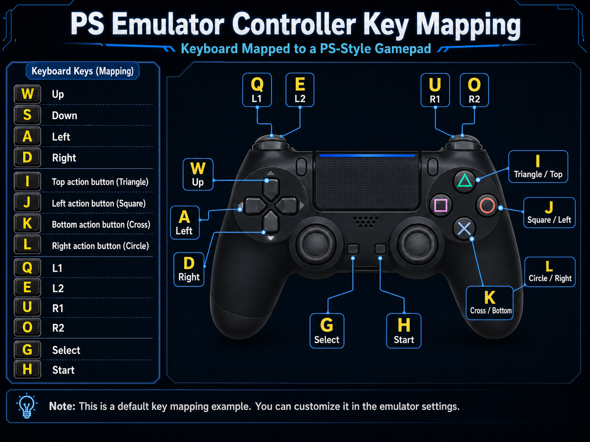

#+title: evil-gamepad

* evil-gamepad

A gamepad-inspired keybinding layout for Evil in Emacs.

This package remaps a small set of core Evil commands into a controller-style
layout:

- Left hand for movement
- Right hand for editing actions

The package intentionally stays small. It only depends on Evil and focuses on
core navigation and editing instead of third-party integrations. The =j= and =J=
bindings can optionally use =avy= when that package is installed.

* Design

The layout is built around a simple mental model:

- =W A S D= handles directional movement
- =Q E= expands movement to words
- =Q/E= uppercase expands movement further
- The right side of the keyboard handles deletion and append actions

The goal is consistency across normal state and visual state, not a full
replacement for every default Evil binding.

* Key Layout

** Normal state

| Key | Command                      |
|------+---------------------------------|
| a    | evil-backward-char               |
| d   | evil-forward-char                |
| w   | evil-previous-line                |
| s    | evil-next-line                    |
| q   | evil-backward-word-begin        |
| e   | evil-forward-word-begin          |
| Q   | tab-bar-switch-to-prev-tab        |
| E   | tab-bar-switch-to-next-tab        |
| A   | evil-beginning-of-line            |
| D   | evil-end-of-line                  |
| W   | evil-backward-paragraph          |
| S   | evil-forward-paragraph           |
| C-w | evil-scroll-page-up               |
| C-s  | evil-scroll-page-down             |
| h   | magit-status                      |
| j    | evil-gamepad-avy-goto-char       |
| J   | evil-gamepad-avy-goto-line        |
| k    | evil-delete-char                  |
| K   | evil-delete-backward-char-and-join |
| C-k | evil-delete-backward-word        |
| l    | evil-append                     |
| L    | evil-append-line                 |

** Visual state

Visual state keeps the same movement layout for consistency.

| Key | Command |
|-----+--------------------------------|
| a   | evil-backward-char             |
| d   | evil-forward-char              |
| w   | evil-previous-line             |
| s   | evil-next-line                 |
| q   | evil-backward-word-begin       |
| e   | evil-forward-word-begin        |
| A   | evil-beginning-of-line         |
| D   | evil-end-of-line               |
| W   | evil-backward-paragraph        |
| S   | evil-forward-paragraph         |

* Installation

This package is not on MELPA yet.

Add the repository to your =load-path= and enable the mode:

#+begin_src emacs-lisp
(add-to-list 'load-path "/path/to/evil-gamepad.el")
(require 'evil-gamepad)
(evil-gamepad-mode 1)
#+end_src

If you use =use-package=:

#+begin_src emacs-lisp
(use-package evil-gamepad
  :load-path "/path/to/evil-gamepad.el"
  :after evil
  :config
  (evil-gamepad-mode 1))
#+end_src

If you want the =j= and =J= bindings to jump with =avy=, install =avy= separately.
Without =avy=, loading =evil-gamepad= still succeeds and the bindings will show
an explanatory error only when invoked.

* Customization

By default, the package only installs keybindings.

If you also want Evil search behavior tuned for symbol-based searching:

#+begin_src emacs-lisp
(setq evil-gamepad-enable-search-tweaks t)
#+end_src

This enables:

- =evil-symbol-word-search=
- =evil-search-module= set to =evil-search=

* Scope

This package includes minimal integration with popular packages:

- =h= key binding to =magit-status= for quick Git access
- =j= and =J= bindings use =avy= when available

Beyond these, the package does not include bindings for:

- Helm
- Org extensions
- Python tooling
- Multiple cursors
- Modeline packages
- Other third-party packages

Those can be layered on top in user configuration if needed.

* License

See [[file:LICENSE][LICENSE]].
